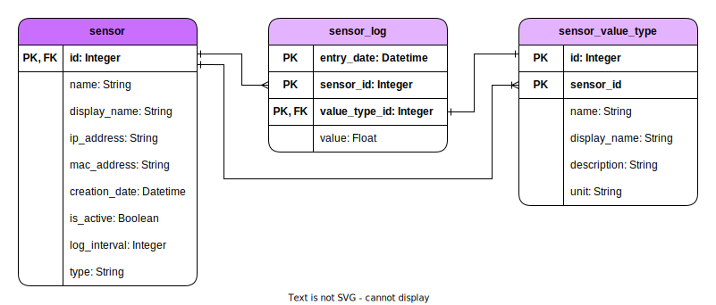

# Database

Postgres is used as the database. Additionally, SQLalchemy is used as the ORM and Alembic as the Migration Tool.

## Database Schema

Below is the description of the database schema using an ER diagram.

### Sensor Schema

The table `sensor` contains all sensors that are to be installed or logged. A sensor can have multiple channels. For example, a sensor can measure temperature and power. These channels are represented in the table `sensor_value_type`. The logged data is finally stored in the table `sensor_log` with the corresponding `sensor_id` and `value_type_id`.

